<div align="center">
  
</div>

# Mundo Pet 🐾

> Appointment scheduler & manager for pet shops. Vanilla JS + JSON Server. Made with Rocketseat Fullstack course.

## 📌 About the Project

**Mundo Pet** is a web application designed to help pet shops manage their daily appointments efficiently. Originally inspired by a barbershop scheduling system (HairDay), this project was fully adapted, redesigned, and implemented for the pet care context.

The application allows users to schedule services for their pets, automatically blocking past hours and already booked slots. It uses a simulated backend with `json-server` to persist data, providing a complete frontend experience with real-world business logic.

## ✨ Features

- **Create Appointments:** Schedule a service providing the pet's name, owner's name, phone number, service type, and date/time.
- **Dynamic Input Mask:** Automatic formatting for Brazilian phone numbers using Regex.
- **Smart Time Slot Management:**
  - Automatically blocks past hours for the current day.
  - Automatically disables time slots that are already booked to prevent conflicts.
- **Daily Schedule View:** Fetches and displays all appointments for a specific day, categorized by periods (Morning, Afternoon, and Night).
- **Cancel Appointments:** Easily remove an appointment from the schedule with a simple click (triggering a DELETE request).
- **Timezone Reliability:** Uses `Day.js` to handle timezone formatting (`YYYY-MM-DDTHH:mm:ssZ`) and prevent date-shifting bugs.

## 🚀 Technologies Used

- **HTML5 & CSS3:** Semantic markup and custom styling.
- **JavaScript (Vanilla):** Modular ES6+ for all frontend logic and DOM manipulation.
- **Day.js:** Lightweight library for advanced date and time formatting.
- **Webpack:** Frontend tooling and module bundling.
- **JSON Server:** Full fake REST API for backend simulation.

## 📁 Data Structure

Appointments are saved in the `server.json` file following this exact structure:

```json
{
  "id": "1",
  "pet": "Thor",
  "owner": "Fernanda Costa",
  "phone": "(11) 9 8765-4321",
  "service": "Vacinação",
  "when": "2024-05-20T09:00:00-03:00"
}
```

## 🛠️ Getting Started

Follow the instructions below to run the project in your local environment.

### Prerequisites

Make sure you have [Node.js](https://nodejs.org/) installed on your machine.

### Installation

1. Clone the repository:
```bash
git clone https://github.com/AndrePassoni/mundo-pet.git
```

2. Navigate to the project directory:
```bash
cd mundo-pet
```

3. Install the dependencies:
```bash
npm install
```

### Running the Application

You will need two terminal windows to run the frontend and the fake API simultaneously.

1. **Start the JSON Server (API):**
```bash
npm run server
```
*(The API will be available at `http://localhost:3333`)*

2. **Start the Frontend Application:**
```bash
npm run dev
```
*(Open the local URL provided in your terminal to view the project)*

---
<p align="center">
  Made with 💜 by <a href="https://github.com/AndrePassoni">André Passoni</a>
</p>